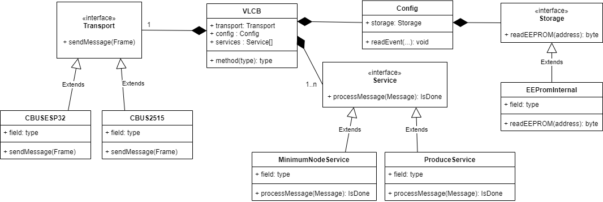

# Design Overview

This VLCB library is based on Duncan Greenwood's [CBUS library](https://github.com/MERG-DEV/CBUS)
and extended with VLCB specific features.

This library is still in progress. It does not yet build.

The code is organized as a central control object (VLCB) that controls a transport object, 
a storage object and a set of service objects.
The library supports a set of different transports such as CAN, Wifi and BLE.
The library supports a set of storage for node variables and event variables in EEPROM or Flash memory.
The services are split in functionalities so that the user sketch can bring in the functionality
that is necessary for the VLCB module that is created.

A class diagram is shown below with a selection of concrete implementations of transports, storage, 
and services.


Some details:
* The Config object stores node variables (NV) and event variables(EV) and any other configuration
  that is required. It makes use of a storage object that has different implementations for different
  storage types. Not all Arduino modules have EEPROM or enough EEPROM. Instead, external EEPROM or
  Flash memory can be used.
  See furter details in [Persistent Storage](PersistentStorage.md) documentation.
* There is no queuing in this diagram. Message queuing is expected to happen in the transport layer.
  Some transport hardware has message queues builtin, for others the transport implementation
  will include queues.

## Workflow
The main workflow is that the VLCB control object runs every so often from the sketch loop() function.
Each iteration checks the transport object if there are any incoming messages. 
Such incoming messages are offered to each of the service objects in turn.
The service object responds with a code to say if the message has been taken care of and no other
services need to look at this.

The EventConsumerService may react to consumed events by calling a user registered callback so that
the user sketch can act on this event for example to turn on an LED or move a servo.

The user sketch may produce events when are passed on the VLCB control object which in turn passes 
this event as a message to the transport object.

## User Sketch

A user sketch needs to set up the required VLCB objects and then call ```VLCB.progress()``` from 
the main loop.

The setup code may look like:
```
// Global definitions
VLCB::CanTransport canTransport(interruptPin, csPin); 
VLCB::EepromInternalStorage eepromStorage
VLCB::MnsService mnsService;
VLCB::EventConsumerService eventConsumerService(myActionCallback);
VLCB::Controller moduleController(canTransport, eepromStorage, {mnsService, eventConsumerService});

setup()
{
  canTransport.setNumBuffers(2);
  canTransport.setOscFreq(OSC_FREQ);
  canTransport.begin();
}
```

## Design Decisions to Make

### Naming Convention
A naming convention needs to be defined. 
It needs to distinguish global names so there are no conflicts with other libraries.

Some suggestions:
* Use "VLCB_" as a prefix for all names provided by the library. This requires a lot of typing.
* Use a "VLCB" namespace. Code within this namespace can use the shorter names.

### User Interface
It may be pretentious to talk about a "User Interface" that only consists of two LEDs and a push button.
However, the Arduino users have suggested that a user interface could be made up of a serial 
communication or an OLED display or even a touch-screen.
There should be provision for a user interface that can be implemented for different ways of
communicating with the user.

### Self Consumed Events
Duncan's library does not support self consumed events. 

Events that the VLCB module consumes cannot be consumed/processed immediately as this might 
create an infinite loop in case that processing generates new events.
Instead, some queuing needs to be implemented. 

One suggestion is to add a queue within the VLCB control object.
When producing a new message it is passed to the transport object and put on the VLCB queue. 
When VLCB checks for next message, it first checks this queue and if it is empty it checks 
the transport object. 
The queues within the transport object is not used as some implementations might not have 
any such queues.