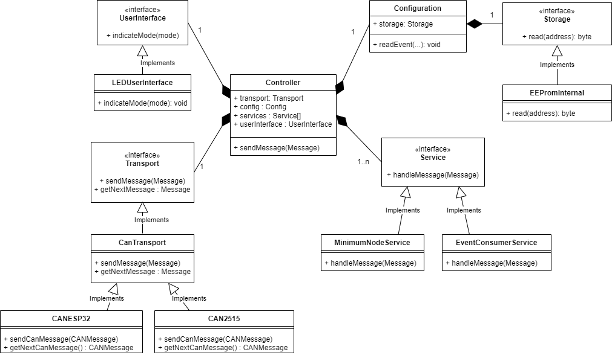

# Design Overview
This document describes the main components within the VLCB library and how they interact.


This VLCB library is based on Duncan Greenwood's [CBUS library](https://github.com/MERG-DEV/CBUS)
and extended with VLCB specific features.

## High Level Architecture
The code is organised as a central controller object that controls functionality
via a storage object and a set of service objects.

Services implement various groups of functionality within VLCB such as events or DCC control.
The user sketch can select the set of services needed to provide the necessary functionality
for the VLCB module that is created.
There are also services for user interfaces and communication over different transports such as CAN, Wi-Fi and BLE.
Currently only a CAN transport using the CAN2515 chip is included in the library.

The library supports storage for node variables and event variables in EEPROM or Flash memory.
A Configuration object controls persistence of node specific data such as parameter, node variables
and events using the chosen storage.

A class diagram is shown below with a selection of concrete implementations of transports, storage, 
and services.


### Details
* There is no message queuing in this diagram. Message queuing is expected to happen in the transport layer.
  Some transport hardware has message queues builtin, for others the transport implementation
  will include queues.

## Workflow
The Controller maintains a ```Action``` bus, which is implemented as a circular buffer of 
[Action](../html.library/struct_v_l_c_b_1_1_action.html) objects.
Each service can put actions on this bus and act on actions placed there by other services.
An action represents tasks or information to be shared with other services. 
The Action bus decouples services from each other and makes it easier to add new services.

The main workflow is that the VLCB Controller object runs every so often from the sketch loop() function
which calls `VLCB::process()`.
During each iteration the controller calls out to each service to do any processing it needs to do. 
The top element on the action bus (if any) is included in this call.

The ```CanService``` checks for incoming messages on the CAN bus and if the action object passed
from the controller is an outgoing message it sends it to the CAN bus.

The ```EventConsumerService``` may react to consumed events by calling a user registered callback so that
the user sketch can act on this event for example to turn on an LED or move a servo.

The user sketch may produce events that are managed by the ```EventProducerService``` object which then passes
the event as an Action via the Controller to the transport object.

A user interface service may put actions on the queue to start CAN enumeration,
or change mode of the node.
The user interface service will also react to actions that indicate that work
has been performed by the node.

### Dataflow
Most of the VLCB functionality uses a message object ```VlcbMessage``` that passes incoming and
outgoing messages around via the Action bus. 
The ```VlcbMessage``` object contains 8 bytes where the first is the op-code and the remaining 7 bytes
are any optional data bytes for that op-code.

The ```CanService``` translates the ```VlcbMessage``` to/from a ```CANFrame``` class that contains 
CAN specific fields and a ```VlcbMessage``` in its data portion.

The ```CanTransport``` object translates the ```CANFrame``` object to and from an object that represents
a CAN frame containing an id, 8 bytes of data (same as the VlcbMessage) and the flags
```rtr``` and ```ext```.
This CAN frame is then passed to or from a CAN driver, such as CAN2515. 
CAN drivers may need to convert this CAN frame to a data structure used by any library
that is used by that driver.

### TimedResponse
A service may respond to a request with a large number of response messages.
Instead of creating these messages immediately and putting these on the Action bus
a `TimedResponse` is used to delay creation of these response messages until
they can be added to the Action bus.

A service creates a task object which is added to TimedResponse.
The TimedResponse then calls this task object every 5ms to allow it to send one 
response message. 
The task object maintains a sequence counter to keep track of which response to 
send at each call.

The 5ms interval gives the system enough time to process and transmit the sent
message without any of the CAN queues filling up.

## Configuration
The Configuration object stores node variables (NV) and event variables(EV) and any other configuration
that is required. It makes use of a storage object that has different implementations for different
storage types. Not all Arduino modules have EEPROM or enough EEPROM, in which case external EEPROM or
Flash memory can be used.
See further details in [Persistent Storage](PersistentStorage.md) documentation.

The configuration support is divided into a Configuration object that manages NVs and EVs.
It provides functions that deal with these NVs and EVs. 
It makes use of a Storage interface where implementing classes store the data at a given
address.

There are a few classes that implement the 
[Storage](../html.library/class_v_l_c_b_1_1_storage.html) interface:

[EepromInternalStorage](../html.library/class_v_l_c_b_1_1_eeprom_internal_storage.html)
: Stores data in EEPROM directly on the processor.

[EepromExternalStorage](../html.library/class_v_l_c_b_1_1_eeprom_external_storage.html)
: Stores data in external EEPROM connected via I2C.

[DueEepromEmulationStorage](../html.library/class_v_l_c_b_1_1_due_eeprom_emulation_storage.html)
: Support by emulating EEPROM for the Arduino DUE.

[FlashStorage](/html.library/class_v_l_c_b_1_1_flash_storage.html)
: Stores data in Flash memory. Useful for modules that do not have onboard EEPROM or too
little EEPROM.

## Services

The interpretation of incoming messages is handled by a set of services.
VLCB offers up a message to each service in turn. 
If a service is able to handle that message no further services will be offered the message.
Thus, the order of configured services is important.

Read more about the [Service](../html.library/class_v_l_c_b_1_1_service.html) interface and how services work in 
[Service documentation](Service.md).
