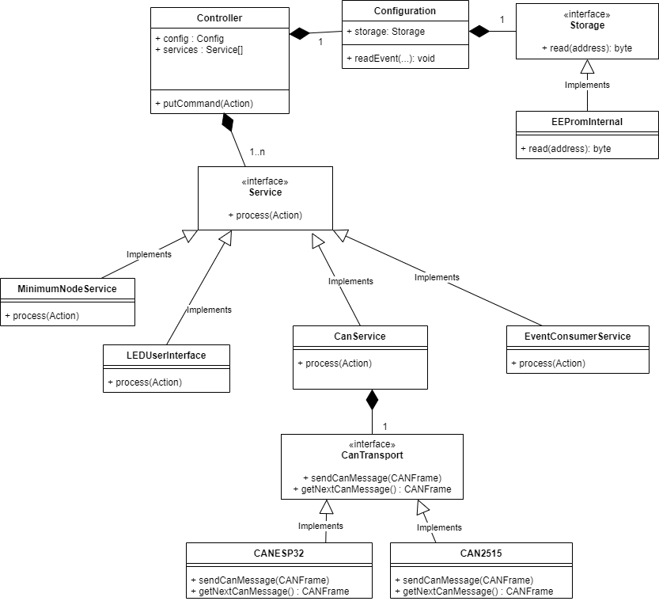

# Design Overview
This document describes the main components within the VLCB library and how they interact.


This VLCB library is based on Duncan Greenwood's [CBUS library](https://github.com/MERG-DEV/CBUS)
and extended with VLCB specific features.

This library is still in progress.

## High Level Architecture
The code is organized as a central controller object that controls functionality
via a storage object and a set of service objects.

Services implement various groups of functionalities within VLCB such as events or DCC control.
The user sketch can select the set of services needed to provide the functionality
that is necessary for the VLCB module that is created.
There are also services for user interfaces and communication over different transports such as CAN, Wifi and BLE.
Currently only a CAN transport using the CAN2515 chip is included in the library.

The library supports a set of storage for node variables and event variables in EEPROM or Flash memory.
A Configuration object controls persistence of node specific data such as parameter, node variables
and events using the chosen storage.

A class diagram is shown below with a selection of concrete implementations of transports, storage, 
and services.


### Details
* There is no message queuing in this diagram. Message queuing is expected to happen in the transport layer.
  Some transport hardware has message queues builtin, for others the transport implementation
  will include queues.

## Workflow
The Controller maintains a ```Command``` bus, which is implemented as a circular buffer.
Each service can put commands on this bus and act on commands placed there by other services.

The main workflow is that the VLCB Controller object runs every so often from the sketch loop() function.
During each iteration the controller calls out to each service to do any processing it needs to do. 
The top element on the command bus (if any) is included in this call.

The ```CanService``` checks for incoming messages on the CAN bus and if the command object passed
from the controller is an outgoing message it sends it to the CAN bus.

The ```EventConsumerService``` may react to consumed events by calling a user registered callback so that
the user sketch can act on this event for example to turn on an LED or move a servo.

The user sketch may produce events when are passed on the ```EventProducerService``` object which in turn passes
this event as a Command via the Controller to the transport object.

### Dataflow
Most of VLCB functionality use a message object ```VlcbMessage``` that is used to pass incoming and
outgoing messages around via the Command bus. 
The ```VlcbMessage``` object contains 8 bytes where the first is the op-code and the remaining 7 bytes
are any optional data bytes for that op-code.

The ```CanTransport``` object translates the VlcbMessage object to from an object that represents
a CAN frame which contains an id, 8 bytes of data (same as the VlcbMessage) and the flags
```rtr``` and ```ext```.
This CAN frame is then passed to/from the CAN driver such as CAN2515. 
CAN drivers may need to convert this CAN frame to a data structure used by any library
that is used by that driver.

Currently, this CAN frame is stored in a ```CANMessage``` object defined in the ACAN2515 library.
This should be replaced with another class that doesn't depend on an external library

## Configuration
The Configuration object stores node variables (NV) and event variables(EV) and any other configuration
that is required. It makes use of a storage object that has different implementations for different
storage types. Not all Arduino modules have EEPROM or enough EEPROM. Instead, external EEPROM or
Flash memory can be used.
See furter details in [Persistent Storage](PersistentStorage.md) documentation.

The configuration support is divided into a Configuration object that manages NVs and EVs.
It provides functions that deal with these NVs and EVs. 
It makes use of a Storage interface where implementing classes store the data at a given
address.

There are a few implementing storage classes:

EepromInternalStorage
: Stores data in EEPROM directly on the processor.

EepromExternalStorage
: Stores data in external EEPROM connected via I2C.

DueEepromEmulationStorage
: Support by emulating EEPROM for the Arduino DUE.

FlashStorage
: Stores data in Flash memory. Useful for modules that do not have onboard EEPROM or too
little EEPROM.

## CanTransport
The CanTransport interface encapsulates the transmission of VLCB message across some
media such as CAN bus.

The class ```CanTransport``` serves as a base class for implementations of CAN based transports. 
It handles CANID enumeration and conflict detection that would be the same for all CAN based transports. 

Current implementing transport classes:

CAN2515
: Transport over CAN bus using the MCP2515 chip.

More transports implementations exist but have not yet been imported here.

Read more about the ```Transport``` interface and how to implement new transports in
[Transport documentation.](Transport.md)

## Services

The interpretation of incoming messages is handled by a set of services.
VLCB offers up a message to each service in turn. 
If a service is able to handle that message no further services will be offered the message.
Thus, the order of configured services is important.

Read more about the ```Service``` interface and how services work in 
[Service documentation](Service.md).

Examples of some services:

MinimumNodeService
: Handles all the mandatory op-codes that all VLCB modules must implement. 
These op-codes involves running modes and basic node configuration such as node number and
module parameters.

EventConsumerService
: Handles incoming events that shall result in actions on the module.
If the COE parameter is set it will also handle outgoing events.

ConsumeOwnEventsService
: Enables passing events produced by the producer service back to the consumer service.
It doesn't do anything else than setting the COE parameter flag which also tells
the EventConsumerService to also look for outgoing events on the command bus.

LongMessageService
: Handles the long message extension to CBUS as defined in RFC005.

LEDUserInterface
: Implements a low level UI using a push button, a green LED and a yellow LED.

It will be possible to implement new user interfaces that make use of an OLED screen or simply
uses the USB connection for serial communication.

## User Sketch

A user sketch needs to set up the required VLCB objects and then call ```VLCB.process()``` from 
the main loop.

The setup code may look like:
```
// Global definitions
VLCB::LEDUserInterface userInterface(greenLedPin, yellowLedPin, pushButtonPin); 
VLCB::CAN2515 can2515(interruptPin, csPin); 
VLCB::CanService canService(&can2515);
VLCB::EepromInternalStorage eepromStorage;
VLCB::MnsService mnsService;
VLCB::EventConsumerService eventConsumerService(myActionCallback);
VLCB::Controller moduleController(eepromStorage, {mnsService, userInterface, canService, eventConsumerService});

setup()
{
  canTransport.setNumBuffers(2);
  canTransport.setOscFreq(OSC_FREQ);
  canTransport.begin();
}
```
See also the example sketches how to use the VLCB library.